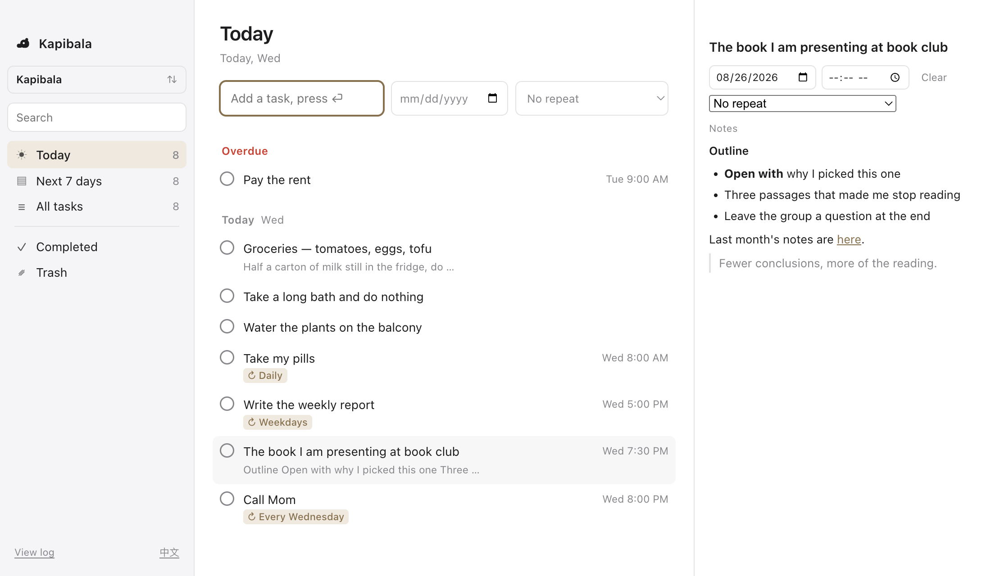

# Kapibala · 卡皮巴拉

**English** · [简体中文](./README.zh.md)

Kapibala is a to-do app for macOS. All of your data lives on your own disk.

**It pairs best with iCloud Drive.** Put the folder in iCloud (or Dropbox, or any sync service) and your Macs stay in sync automatically.

## 1. Download

Grab the matching `.dmg` from [Releases](https://github.com/yaodongen/kapibala/releases/latest), open it, and drag Kapibala into your Applications folder.

| Your Mac | Download |
| -------------- | ---------------------- |
| Apple silicon (M series) | `Kapibala-*-arm64.dmg` |
| Intel | `Kapibala-*-x64.dmg` |

> The build is not notarized by Apple yet, so Gatekeeper blocks the first launch. Two ways around it:
>
> - Double-click once (it will be refused), then open **System Settings → Privacy & Security** and click "Open Anyway" near the bottom
> - Or run one line in a terminal: `xattr -dr com.apple.quarantine /Applications/Kapibala.app`

## 2. Getting started

1. Launch Kapibala and pick a folder to be your **vault**. Every task lives in there.
2. To sync across Macs, pick a folder inside iCloud Drive — for example `~/Library/Mobile Documents/com~apple~CloudDocs/Kapibala`. On your other Mac, open the same folder.
3. Start writing tasks.

Multiple vaults work too: one for work, one for life, switched at any time and never mixed.

Want a backup? `cp -r` or Time Machine. Done with the app? Delete it — the data is still yours.

## 3. Features

**Tasks**

- Notes, with Markdown
- Start date and time
- Multiple reminders
- **Repeating tasks**: daily / weekly on a weekday / weekdays only / monthly on a date / **the second Tuesday of every month** / yearly, and also "N days after I finish it"
- One click to complete, one click to delete (into the trash, not gone for good)
- **Search** across titles and notes; space-separated words all have to match

**Views**

- Today
- **Next 7 days**: grouped by date and weekday, soonest first, with overdue tasks pinned in their own group on top
- All tasks
- Completed
- Trash

**Interface**

- English and Chinese. It follows your Mac's language, and you can switch any time from the bottom-left corner

## 4. Privacy

- **Zero network requests.** The app itself never goes online. No account, no telemetry, no crash reports, no "anonymous usage statistics".
- **Syncing is done by the provider you choose.** Whether your data goes to a cloud, and whose cloud, is your call. Skip iCloud and it is a purely local app.
- **A readable format.** Storage is plain text, not an opaque binary blob. You can see exactly what the app wrote, whenever you want.

## 5. FAQ

**Why no iOS / Android version?**
Mac only. A narrow scope, done properly.

**Do I have to use iCloud?**
No. The vault folder can live anywhere — `~/Documents`, an external drive, Dropbox, any sync service. Keep it off a synced drive and the app is purely local.

**"Kapibala"?**
Capybara. The least anxious animal on earth. A to-do list should make you a little more like one.

## 6. License

MIT, see [LICENSE](./LICENSE).
