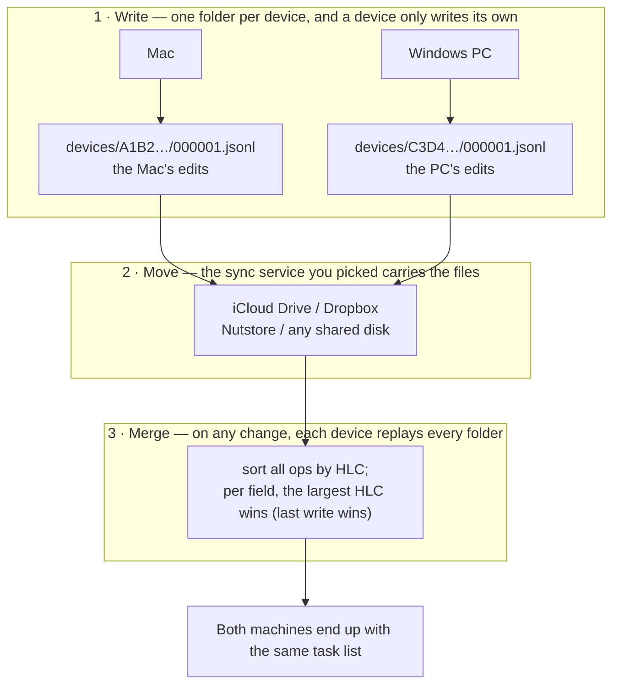

# <sub></sub> Kapibala · 卡皮巴拉

**English** · [简体中文](./README.zh.md)

Kapibala is a to-do app for macOS and Windows. Like Obsidian, it keeps all of your data on your own disk.

**It never goes online.** Your tasks are plain text in a folder you pick — read them, back them up, delete them, whenever you like.

**Put it on a synced drive and your devices stay in sync.** iCloud Drive, OneDrive, Dropbox, Nutstore — any of them works, and a Mac and a Windows PC can share the same vault. Keep it off a synced drive and Kapibala is a purely local app.


## 1. Download

Grab the package for your platform from [Releases](https://github.com/yaodongen/kapibala/releases/latest).

**macOS**: open the `.dmg` and drag Kapibala into your Applications folder. It runs on macOS 12 (Monterey) or later.

| Your Mac | Download |
| -------------- | ---------------------- |
| Apple silicon (M series) | `Kapibala-*-arm64.dmg` |
| Intel | `Kapibala-*-x64.dmg` |

> The build is not notarized by Apple yet, so Gatekeeper blocks the first launch. Two ways around it:
>
> - Double-click once (it will be refused), then open **System Settings → Privacy & Security** and click "Open Anyway" near the bottom
> - Or run one line in a terminal: `xattr -dr com.apple.quarantine /Applications/Kapibala.app`
>
> Notarizing requires an Apple Developer Program membership at $99/year. This project is free and has not paid that bill, so the extra click is on you.

**Windows**: run `Kapibala-<version>-x64-setup.exe` and click through the installer. It installs into your user folder — no admin rights, and no Node or other runtime to install first.

> It is not code-signed there either, so SmartScreen stops the first launch once: click "More info" → "Run anyway".

## 2. Getting started

1. Launch Kapibala and pick a folder to be your **vault**. Every task lives in there.
2. To sync across devices, pick a folder inside a sync drive — on a Mac, say iCloud Drive's `~/Library/Mobile Documents/com~apple~CloudDocs/my-todo`; on Windows, say a folder inside OneDrive. Open the same folder on the other machine.
3. Start writing tasks.

Multiple vaults work too: one for work, one for life, switched at any time and never mixed.

Want a backup? Copy the whole folder (on macOS `cp -r` or Time Machine; on Windows just drag it somewhere). Done with the app? Delete it — the data is still yours.

## 3. How your devices stay in sync

Every machine — Mac or Windows — owns one subfolder inside the vault and writes only there; the sync service you picked just carries files around.



1. **Write.** Every edit becomes one line appended to a log file in your own device folder (`devices/A1B2…/`). A machine never writes into another machine's folder.
2. **Move.** Your sync service uploads the files it finds and downloads the ones it does not have yet. Plain files, nothing else.
3. **Merge.** When the vault changes, each machine re-reads every device folder and sorts all ops by HLC — a hybrid logical clock, wall time plus a counter plus the device ID, so the order is total and agreed on by everyone. Per field, the largest HLC wins.

Two edits to the same task on two machines are not a conflict: whichever write is later wins for each individual field, and fields nobody touched are left alone. The rule does not depend on the order things arrive in, so both land on exactly the same task list — including after edits made while one of them was offline, which simply land when the file syncs.

Because no file is ever written by two machines, the classic synced-folder failure — the `000001 2.jsonl` conflict copy — cannot happen. The same holds across platforms: a Mac and a PC can share one vault because neither ever writes into the other's device folder.

## 4. Features

**Tasks**

- Notes, with Markdown
- Start date and time
- **Drag to reschedule**: in a calendar view, drag a task from one day to another — the time of day stays
- **Repeating tasks**: daily / weekly on a weekday / weekdays only / monthly on a date / **the second Tuesday of every month** / **the last day of every month** / yearly, and **every N days** (type 17, say)
- One click to complete, one click to delete (into the trash, not gone for good); the trash empties in one click
- **In progress**: mark a task from the right-click menu and its row lights up with a "Doing" badge;
  several tasks can be in progress at once, and completing or trashing one clears it
- **Search** across titles and notes; space-separated words all have to match

**Views**

- Today
- **Next 7 days**: grouped by date and weekday, soonest first, with overdue tasks pinned in their own group on top
- Next 30 days: same grouping, for the month ahead
- **Calendar (7d)**: overdue + the next 7 days, tiled by day in a 4 × 2 grid, overdue in the first cell
- **Calendar (14d)**: overdue + the next 14 days, in a 5 × 3 grid
- All tasks
- **Completed**: grouped by the day you finished it, most recent day first, with the time of day on the left of each row
- Trash

**Interface**

- English and Chinese. It follows your Mac's language, and you can switch any time from the bottom-left corner
- The bottom-left corner shows the version number; clicking it opens the log
- Window size is remembered per view: the two calendar views each keep their own, so switching back restores the size you dragged
- Closing the window just tucks it away and the app keeps running. To really quit: on macOS right-click the Dock icon and choose Quit; on Windows right-click the tray icon

## 5. Privacy

- **It never goes online.** The only thing that touches your tasks is the sync service you picked.
- **A readable format.** Storage is JSON Lines — one JSON object per line, plain text, not an opaque binary blob. You can see exactly what the app wrote, whenever you want. The layout is documented in [`docs/storage.md`](./docs/storage.md).

## 6. FAQ

**Do I have to use iCloud?**
No. The vault folder can live anywhere — `~/Documents`, an external drive, Dropbox, Nutstore, any sync service. Keep it off a synced drive and the app is purely local.

**Can a Mac and a Windows PC share one vault?**
Yes — that is a design goal now. Each machine gets its own device folder inside the vault, so mixing platforms causes no fights, and tasks and notes look identical on both sides. The only requirement is that your sync service carries files across unchanged (iCloud Drive, OneDrive, Dropbox and Nutstore all do).

**"Kapibala"?**
Capybara. The least anxious animal on earth. A to-do list should make you a little more like one.

## 7. Development

Needs Node 22.18+ (the sources run directly, there is no compile step) and `corepack`. One command builds the app and installs it into `/Applications`:

```bash
make install-app
```

On a fresh clone, run `make install` once first. `make help` lists everything else — launching a dev build, tests, dmg / setup.exe, the CLI.

**Windows**: development happens on macOS — no Windows dev machine needed. `make win` cross-builds `apps/desktop/release/Kapibala-*-setup.exe` from a Mac, and on a release GitHub Actions builds both platforms for the same tag.

To see what the Windows branch looks like while sitting on a Mac (the tray, the window buttons Windows draws itself, the layout inset, `Ctrl+Enter`), flip one switch:

```bash
cd apps/desktop
KAPIBALA_OS=win32 corepack pnpm exec electron .
```

Two things differ from macOS on Windows, both decided by the OS: closing the window **hides it to the tray** (right-click the tray icon and pick Quit to really exit — otherwise a closed window can be neither reached nor dismissed); and app data lives in `%APPDATA%\Kapibala`, never inside the vault folder, same as on the Mac. Syncing is unchanged — OneDrive, Dropbox, Nutstore all work; there is just no iCloud "placeholder not downloaded yet" state to handle.

Design notes live in [`docs/`](./docs): [`architecture.md`](./docs/architecture.md) for how the pieces fit together, [`storage.md`](./docs/storage.md) for the on-disk format.

## 8. License

MIT, see [LICENSE](./LICENSE).
