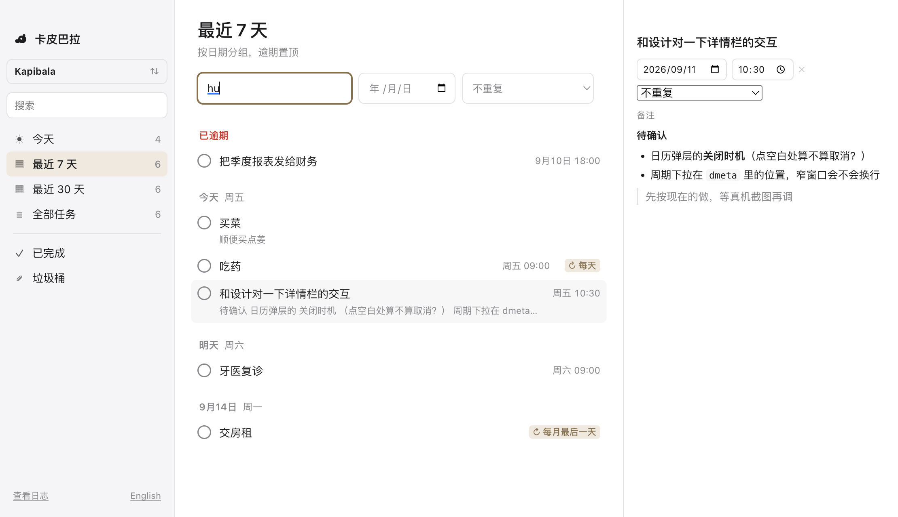

# Kapibala · 卡皮巴拉

[English](./README.md) · **简体中文**

Kapibala（卡皮巴拉）是一个 macOS 待办清单应用，所有数据存储在你自己的磁盘上。

**最佳搭配是 iCloud Drive。** 把这个文件夹放进 iCloud（或 Dropbox、坚果云），多台 Mac 就自动同步

## 1. 下载

到 [Releases](https://github.com/yaodongen/kapibala/releases/latest) 下载对应的 `.dmg`，打开后把 Kapibala 拖进「应用程序」。

| 你的 Mac         | 下载                     |
| -------------- | ---------------------- |
| Apple 芯片（M 系列） | `Kapibala-*-arm64.dmg` |
| Intel 芯片       | `Kapibala-*-x64.dmg`   |

> 这个包还没有经过 Apple 公证，首次打开会被 Gatekeeper 拦下。两种办法：
>
> - 双击一次（会被拒），然后到 **系统设置 → 隐私与安全性**，在下方点「仍要打开」
> - 或者终端里一句：`xattr -dr com.apple.quarantine /Applications/Kapibala.app`
>
>  Apple Developer Program 需要99 美元/年。这个项目免费，暂时没交这笔钱，所以只能麻烦你多点一下。

## 2. 快速开始

1. 打开 Kapibala，选一个文件夹作为你的「库」，任务都存在这里。
2. 想多台 Mac 同步，就选一个 iCloud Drive 里的目录，比如 `~/Library/Mobile Documents/com~apple~CloudDocs/Kapibala`。在另一台 Mac 上打开同一个目录即可。
3. 开始记任务。

也支持多个库：工作一个、生活一个，互不干扰，随时切换。

想备份？`cp -r` 或者 Time Machine。想不用了？删掉 App，数据还是你的。

## 3. 功能

**任务**

- 备注（支持 Markdown）
- 开始时间
- 多个提醒
- **周期任务**：每天 / 每周某天 / 工作日 / 每月某日 / **每月第二个周二** / **每月最后一天** / 每年，也可以自己填天数（比如每 17 天），还支持「完成后 N 天再来」
- 一键完成、一键删除（进垃圾桶，不是真删）；垃圾桶可以一键清空
- **搜索**：标题和备注，空格分隔多个词按全部命中

**视图**

- 今天
- **最近 7 天**：按日期 + 周几分组，最近的排在最前，逾期任务单独置顶一组
- 最近 30 天：同样的分组，看一个月内的安排
- 全部任务
- 已完成
- 垃圾桶

**界面**

- 中文和英文，默认跟随系统语言，也可以在左下角随时切换
- 关掉窗口只是收起来，应用留在后台；要真的退出，右键 Dock 图标选「退出」

## 4. 隐私

- **零网络请求。** 应用本身不联网。没有账号、没有遥测、没有崩溃上报、没有「匿名使用统计」。
- **同步由你选的服务商完成。** 数据是否上云、上哪家的云，是你的决定。不用 iCloud 就是纯本地应用。
- **格式可读。** 存储是纯文本，不是二进制黑盒，你随时能看清应用写了什么。

## 5. 常见问题

**为什么不做 iOS / Android 版？**
只做 Mac，范围收敛，做好一件事。

**必须用 iCloud 吗？**
不。库目录放在任何地方都行——`~/Documents`、外置硬盘、Dropbox、坚果云。不放同步盘就是纯本地应用。

**「卡皮巴拉」？**
水豚。世界上最不焦虑的动物。待办清单应该让你更像它一点。

## 6. 许可

MIT，见 [LICENSE](./LICENSE)。

