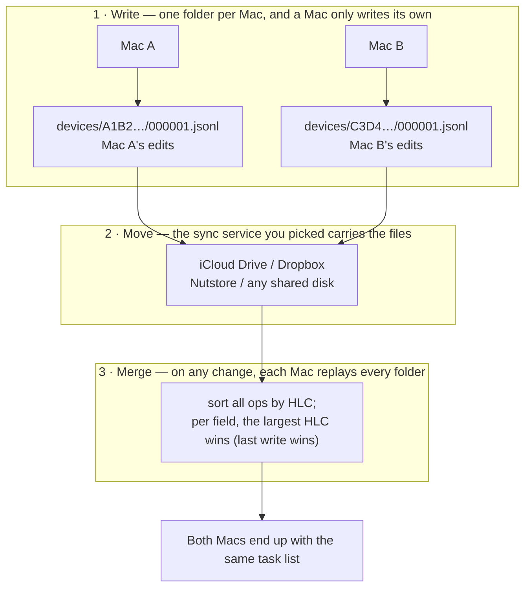

# <sub></sub> Kapibala · 卡皮巴拉

[English](./README.md) · **简体中文**

Kapibala（卡皮巴拉）是一个 macOS 待办清单应用，和 Obsidian 一样，你的所有数据存储在你自己的磁盘上。

**它不联网。** 你的任务就是你选的文件夹里的纯文本——想读就读、想备份就备份、想删就删。

**最佳搭配是 iCloud Drive。** 把这个文件夹放进 iCloud（或 Dropbox、坚果云，或任何同步服务），多台 Mac 就自动同步。不放同步盘，它就是纯本地应用。


## 1. 下载

到 [Releases](https://github.com/yaodongen/kapibala/releases/latest) 下载对应的 `.dmg`，打开后把 Kapibala 拖进「应用程序」。需要 macOS 12（Monterey）或更新版本。

| 你的 Mac         | 下载                     |
| -------------- | ---------------------- |
| Apple 芯片（M 系列） | `Kapibala-*-arm64.dmg` |
| Intel 芯片       | `Kapibala-*-x64.dmg`   |

> 这个包还没有经过 Apple 公证，首次打开会被 Gatekeeper 拦下。两种办法：
>
> - 双击一次（会被拒），然后到 **系统设置 → 隐私与安全性**，在下方点「仍要打开」
> - 或者终端里一句：`xattr -dr com.apple.quarantine /Applications/Kapibala.app`
>
> Apple Developer Program 需要 99 美元/年。这个项目免费，暂时没交这笔钱，所以只能麻烦你多点一下。

## 2. 快速开始

1. 打开 Kapibala，选一个文件夹作为你的「库」，任务都存在这里。
2. 想多台 Mac 同步，就选一个 iCloud Drive 里的目录，比如 `~/Library/Mobile Documents/com~apple~CloudDocs/my-todo`。在另一台 Mac 上打开同一个目录即可。
3. 开始记任务。

也支持多个库：工作一个、生活一个，互不干扰，随时切换。

想备份？`cp -r` 或者 Time Machine。想不用了？删掉 App，数据还是你的。

## 3. 多台 Mac 是怎么同步的

每台 Mac 在库里占一个自己的子目录，只往里写；你选的同步服务只负责搬运文件。



1. **写。** 每次改动都往自己设备目录（`devices/A1B2…/`）里的日志文件末尾追加一行。一台 Mac 永远不写别人的目录。
2. **搬。** 你的同步服务把本地文件传上去、把还没有的拉下来。都是普通文件，仅此而已。
3. **合。** 库一变，每台 Mac 就重读所有设备目录，把全部 op 按 HLC 排序——HLC 是混合逻辑时钟（墙上时间 + 计数器 + 设备 ID），排序结果是全序的，每台机器算出来都一样——然后逐字段取 HLC 最大的那个。

同一件事在两台 Mac 上各改一次不算冲突：具体到每个字段，谁写得晚听谁的；没人碰过的字段不受影响。这条规则和「谁先到」无关，所以两台 Mac 得到完全一样的任务列表——包括离线时做的改动，文件同步过去就自动生效。

也因为没有任何一个文件会被两台 Mac 同时写，同步盘最经典的翻车方式——`000001 2.jsonl` 这种冲突副本——结构上就不可能发生。

## 4. 功能

**任务**

- 备注（支持 Markdown）
- 开始日期和时间
- **周期任务**：每天 / 每周某天 / 工作日 / 每月某日 / **每月第二个周二** / **每月最后一天** / 每年，也可以自己填天数（比如每 17 天）
- 一键完成、一键删除（进垃圾桶，不是真删）；垃圾桶可以一键清空
- **搜索**：标题和备注，空格分隔多个词按全部命中

**视图**

- 今天
- **最近 7 天**：按日期 + 周几分组，最近的排在最前，逾期任务单独置顶一组
- 最近 30 天：同样的分组，看一个月内的安排
- 全部任务
- 已完成
- 垃圾桶

**界面**

- 中文和英文，默认跟随系统语言，也可以在左下角随时切换
- 关掉窗口只是收起来，应用留在后台；要真的退出，右键 Dock 图标选「退出」

## 5. 隐私

- **应用本身不联网。** 碰你任务的只有你自己选的同步服务。
- **格式可读。** 存储是 JSON Lines（一行一个 JSON 对象），纯文本，不是二进制黑盒，你随时能看清应用写了什么。格式说明见 [`docs/storage.zh.md`](./docs/storage.zh.md)。

## 6. 常见问题

**必须用 iCloud 吗？**
不。库目录放在任何地方都行——`~/Documents`、外置硬盘、Dropbox、坚果云、任何同步服务。不放同步盘就是纯本地应用。

**「卡皮巴拉」？**
水豚。世界上最不焦虑的动物。待办清单应该让你更像它一点。

## 7. 开发

需要 Node 22.18+（源码直接跑，没有编译步骤）和 `corepack`。一条命令即可打包并装进 `/Applications`：

```bash
make install-app
```

刚 clone 下来时先跑一次 `make install`。其余命令（启动开发版、测试、打 dmg、CLI）都在 `make help` 里。

设计说明在 [`docs/`](./docs)：[`architecture.zh.md`](./docs/architecture.zh.md) 讲各部分怎么配合，[`storage.zh.md`](./docs/storage.zh.md) 讲磁盘上的格式。

## 8. 许可

MIT，见 [LICENSE](./LICENSE)。
