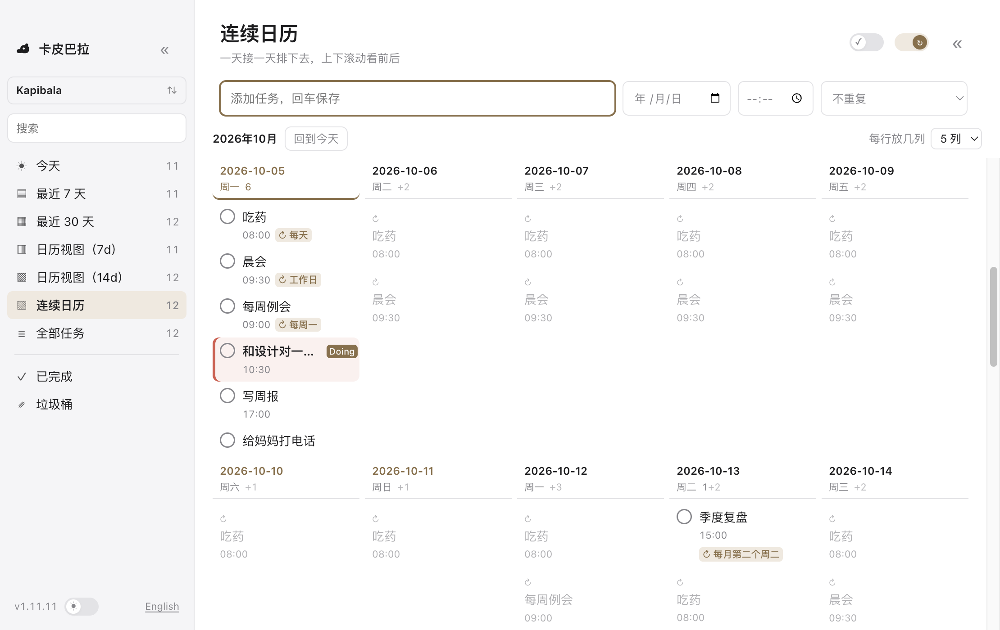
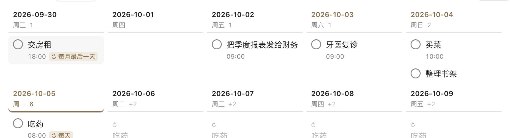
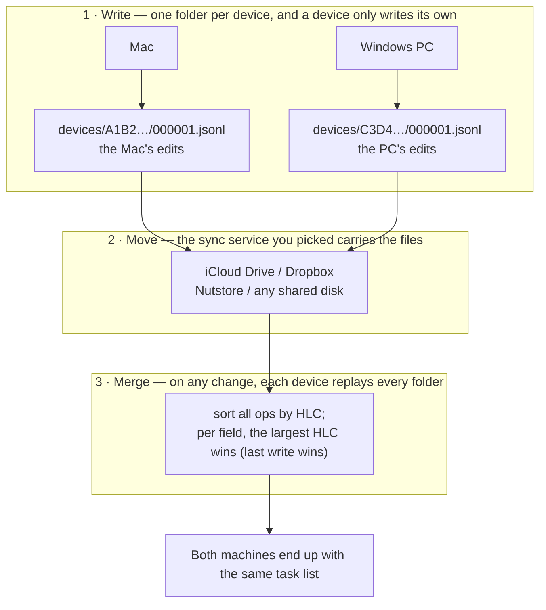

# <sub></sub> Kapibala · 卡皮巴拉

[English](./README.md) · **简体中文**

Kapibala（卡皮巴拉）是一个 macOS / Windows 待办清单应用，和 Obsidian 一样，你的所有数据存储在你自己的磁盘上。

**它不联网。** 你的任务就是你选的文件夹里的纯文本——想读就读、想备份就备份、想删就删。

**把它放进同步盘，多台设备就自动同步。** iCloud Drive、OneDrive、坚果云、Dropbox 都行（Mac 上用 iCloud 最省事），Mac 和 Windows 混着用也可以。不放同步盘，它就是纯本地应用。

**它不催你。** 没有通知、没有红点、没有"逾期 12 项"这种数字，也不会把没做完的事顺延到明天。在「连续日历」里，它们就留在原来那一天，往上滚才看得见 —— 让不重要的事情随着时间过去。



## 1. 「连续日历」：一天接一天

打开就是这一屏。日子**不分月**，一天接一天往下铺，上下都能无限滚：往前翻得到几个月前，往后一直排到几年以后，滚到边就自动接着铺。每行放几个格子由你定（3~7，默认 5）。

- **今天是一道线。** 今天那格不铺底色，只在表头底下压一道强调色的线，两头顺着圆角微微上翘 —— 一屏数字扫下来，一眼就知道自己站在哪。
- **每格自己带着完整日期和周几。** 这一屏没有"周一到周日"的固定列（列和星期本来就不对齐），所以每格都写全：`2026-10-05 / 周一`；周末那两天日期换成强调色。顶栏那行字跟着滚动报当前月份。
- **拖一下就改期。** 把任务从一天拖到另一天，原来的时刻不变；落在哪天、排在第几位，都按你手拖的位置来。
- **周期任务往后排在哪几天，先演给你看。** 「每天读书 20 分钟」这类固定周期的任务，未来会排到哪几天会**置灰**画出来 —— 只是展示：勾不了、拖不动，也不进侧栏条数。「完成后 N 天再来」那种日期取决于你什么时候勾，算不出来，不推。顶栏有开关（默认开），最远推到今天 + 1 年。
- **逾期不堆成一坨。** 没做完的事不会挪到今天，也不会聚成一个越滚越大的清单 —— 它就在原来那一天。往上滚，前几天的事还在那儿躺着。

### 让不重要的事情过去

待办清单最容易长成一份越来越长的欠账单：昨天没做的今天还在，今天没做的明天又在，数字一天比一天大，最后你不想打开它了。

Kapibala 不这么干：

- **今天这一格就是今天的量**，不背昨天的账 —— 昨天的事留在昨天那一格，不顺延，也不算你"欠了多少"。
- **没有通知，没有红点，没有连续打卡**，也没有"逾期 X 项"。你不开它，它不会来找你。
- **想做的时候再做。** 真要紧的事，标一个「重要」就排到那天最前面（左侧一道红竖条）；正在做的标「进行中」，行上带一枚徽标。剩下的，让它过去。



> 上面这张是往上滚回去看的：9 月 30 日到 10 月 4 日没做完的事，都还在各自那一天 —— 没有挪到今天，也没有堆成一份"逾期清单"。

## 2. 下载

到 [Releases](https://github.com/yaodongen/kapibala/releases/latest) 下载对应平台的那个包。

**macOS**：打开 `.dmg`，把 Kapibala 拖进「应用程序」。需要 macOS 12（Monterey）或更新版本。

| 你的 Mac         | 下载                     |
| -------------- | ---------------------- |
| Apple 芯片（M 系列） | `Kapibala-*-arm64.dmg` |
| Intel 芯片       | `Kapibala-*-x64.dmg`   |

> 这个包还没有经过 Apple 公证，首次打开会被 Gatekeeper 拦下。两种办法：
>
> - 双击一次（会被拒），然后到 **系统设置 → 隐私与安全性**，在下方点「仍要打开」
> - 或者终端里一句：`xattr -dr com.apple.quarantine /Applications/Kapibala.app`
>
> Apple Developer Program 需要 99 美元/年。这个项目免费，暂时没交这笔钱，所以只能麻烦你多点一下。

**Windows**：跑 `Kapibala-<版本>-x64-setup.exe`，一路下一步。装在当前用户目录下，不需要管理员权限，也不需要先装 Node 或别的运行时。

> 同样没有代码签名，SmartScreen 会拦一下：点「更多信息」→「仍要运行」。

## 3. 快速开始

1. 打开 Kapibala，选一个文件夹作为你的「库」，任务都存在这里。
2. 想多台设备同步，就选一个同步盘里的目录 —— Mac 上比如 iCloud Drive 的 `~/Library/Mobile Documents/com~apple~CloudDocs/my-todo`，Windows 上比如 OneDrive 里的某个文件夹。在另一台机器上打开同一个目录就行。
3. 开始记任务。

也支持多个库：工作一个、生活一个，互不干扰，随时切换。

想备份？整个文件夹复制一份就行（macOS 上是 `cp -r` 或 Time Machine，Windows 上拖到别处）。想不用了？删掉 App，数据还是你的。

## 4. 多台设备是怎么同步的

每台机器（Mac 也好，Windows 也好）在库里占一个自己的子目录，只往里写；你选的同步服务只负责搬运文件。


```mermaid
flowchart TD
    subgraph W["1 · Write — one folder per device, and a device only writes its own"]
        MA["Mac"] --> FA["devices/A1B2…/000001.jsonl<br/>the Mac's edits"]
        MB["Windows PC"] --> FB["devices/C3D4…/000001.jsonl<br/>the PC's edits"]
    end
    subgraph T["2 · Move — the sync service you picked carries the files"]
        SY["iCloud Drive / Dropbox<br/>Nutstore / any shared disk"]
    end
    subgraph R["3 · Merge — on any change, each device replays every folder"]
        MG["sort all ops by HLC;<br/>per field, the largest HLC wins (last write wins)"]
    end
    FA --> SY
    FB --> SY
    SY --> MG
    MG --> UI["Both machines end up with the same task list"]
```

1. **写。** 每次改动都往自己设备目录（`devices/A1B2…/`）里的日志文件末尾追加一行。一台机器永远不写别人的目录。
2. **搬。** 你的同步服务把本地文件传上去、把还没有的拉下来。都是普通文件，仅此而已。
3. **合。** 库一变，每台机器就重读所有设备目录，把全部 op 按 HLC 排序——HLC 是混合逻辑时钟（墙上时间 + 计数器 + 设备 ID），排序结果是全序的，每台机器算出来都一样——然后逐字段取 HLC 最大的那个。

同一件事在两台机器上各改一次不算冲突：具体到每个字段，谁写得晚听谁的；没人碰过的字段不受影响。这条规则和「谁先到」无关，所以两台机器得到完全一样的任务列表——包括离线时做的改动，文件同步过去就自动生效。

也因为没有任何一个文件会被两台机器同时写，同步盘最经典的翻车方式——`000001 2.jsonl` 这种冲突副本——结构上就不可能发生。Mac 和 Windows 之间同理：混着用一个库，谁都不会去写别人的设备目录。

## 5. 功能

**任务**

- 备注（支持 Markdown）
- 开始日期和时间
- **拖动改期**：在日历视图里把任务从一天拖到另一天，原来的时刻不变
- **周期任务**：每天 / 每周某天 / 工作日 / 每月某日 / **每月第二个周二** / **每月最后一天** / 每年，也可以自己填天数（比如每 17 天）
- 一键完成、一键删除（进垃圾桶，不是真删）；垃圾桶可以一键清空
- **进行中**：右键任务标成进行中，列表里那一行会高亮并带上 "Doing" 徽标；
  可以同时有好几条在进行中，勾完成或删进垃圾桶时会自动收工
- **搜索**：标题和备注，空格分隔多个词按全部命中

**视图**

- **连续日历**：见上面第 1 节，打开就停在这一屏
- 今天
- **最近 7 天**：按日期 + 周几分组，最近的排在最前，逾期任务单独置顶一组
- 最近 30 天：同样的分组，看一个月内的安排
- **日历视图（7d）**：逾期 + 未来 7 天，按天平铺成 4 列 × 2 行，逾期单独占第一格
- **日历视图（14d）**：逾期 + 未来 14 天，5 列 × 3 行
- 全部任务
- **已完成**：按完成的日期 + 周几分组，最近的一天在最前，每行最左边是几点几分完成的
- 垃圾桶

**界面**

- 中文和英文，默认跟随系统语言，也可以在左下角随时切换
- 左下角显示当前版本号，点它就是查看日志
- 窗口大小和详情栏开合按视图记住：三个日历视图算一组，其余视图算一组，切回去就是你上次拖好的样子
- 关掉窗口只是收起来，应用留在后台；要真的退出，macOS 上右键 Dock 图标选「退出」，Windows 上右键系统托盘里的图标

## 6. 隐私

- **应用本身不联网。** 碰你任务的只有你自己选的同步服务。
- **格式可读。** 存储是 JSON Lines（一行一个 JSON 对象），纯文本，不是二进制黑盒，你随时能看清应用写了什么。格式说明见 [`docs/storage.zh.md`](./docs/storage.zh.md)。

## 7. 常见问题

**必须用 iCloud 吗？**
不。库目录放在任何地方都行——`~/Documents`、外置硬盘、Dropbox、坚果云、任何同步服务。不放同步盘就是纯本地应用。

**没做完的任务会一直堆在那儿吗？**
在「连续日历」里它们留在原来那一天，不堆到你眼前。列表视图（今天 / 最近 7 天 / 最近 30 天）会把还没做的旧事收成一组「已逾期」放在最前面，方便你想清理时一次处理掉 —— 但也仅此而已：不提醒、不统计、不会追着你跑。

**Mac 和 Windows 能共用同一个库吗？**
能，这是现在的设计目标之一。每台机器在库里占一个自己的设备目录，混着用不会打架，任务和备注在两边长得一模一样——前提是同步盘能把文件原样搬过去（iCloud Drive、OneDrive、坚果云、Dropbox 都行）。

**「卡皮巴拉」？**
水豚。世界上最不焦虑的动物。待办清单应该让你更像它一点。

## 8. 开发

需要 Node 22.18+（源码直接跑，没有编译步骤）和 `corepack`。一条命令即可打包并装进 `/Applications`：

```bash
make install-app
```

刚 clone 下来时先跑一次 `make install`。其余命令（启动开发版、测试、打 dmg / setup.exe、CLI）都在 `make help` 里。

**Windows**：开发环境只要 macOS，不需要 Windows 开发机。`make win` 在 Mac 上交叉打出 `apps/desktop/release/Kapibala-*-setup.exe`，发布时 GitHub Actions 也会为同一个 tag 同时出两个平台的包。

想在 Mac 上看看 Windows 那条分支长什么样（托盘、系统画的窗口按钮、界面留白、`Ctrl+Enter`），加个开关就行：

```bash
cd apps/desktop
KAPIBALA_OS=win32 corepack pnpm exec electron .
```

Windows 上有两处和 macOS 不一样，都是系统决定的：关掉窗口是**收进托盘**（右键托盘选「退出」才真的退出，不然窗口关了就既回不来也退不掉）；库和界面偏好放在 `%APPDATA%\Kapibala`，和 Mac 上一样不进库目录。同步照旧——OneDrive、坚果云、Dropbox 都行，只是不再有 iCloud 那种"占位符还没下载下来"的概念。

命令行手册在 [`docs/cli.zh.md`](./docs/cli.zh.md)：`make deploy` 装好 `kapi` 之后，`kapi --help` 看命令，`kapi add "买菜" --at today`、`kapi today` 就能用。

设计说明在 [`docs/`](./docs)：[`architecture.zh.md`](./docs/architecture.zh.md) 讲各部分怎么配合，[`storage.zh.md`](./docs/storage.zh.md) 讲磁盘上的格式。

## 9. 许可

MIT，见 [LICENSE](./LICENSE)。
